# Diego Nina Malqui
# Jason Gomez Mancha
# Aplicación de API REST (Django REST Framework)

## Demostración de la API
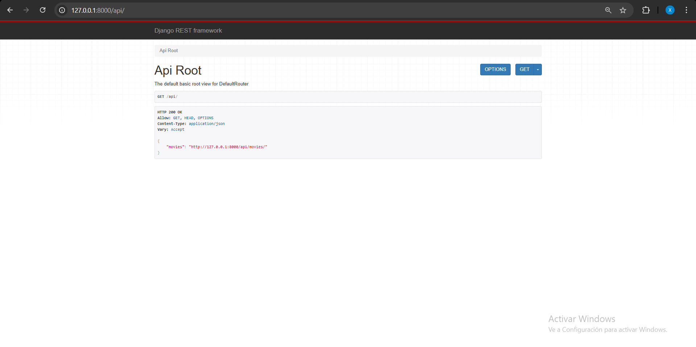

# Lista de Movies
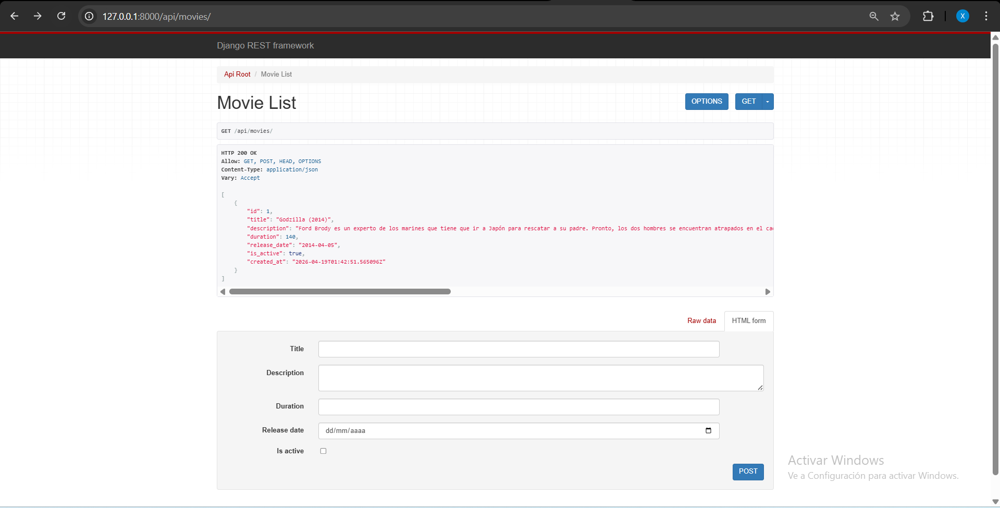

## Test-GET http://127.0.0.1:8000/api/movies/
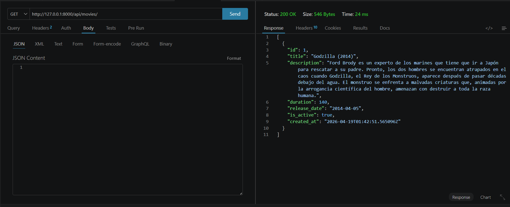
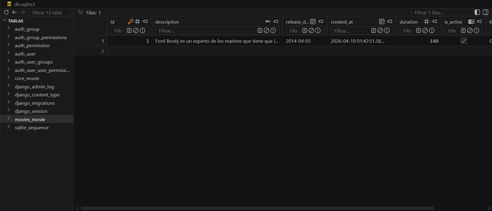

## Test-POST http://127.0.0.1:8000/api/movies/
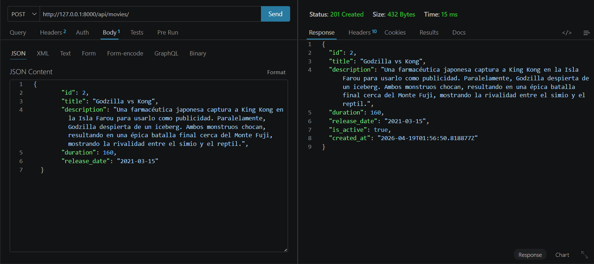
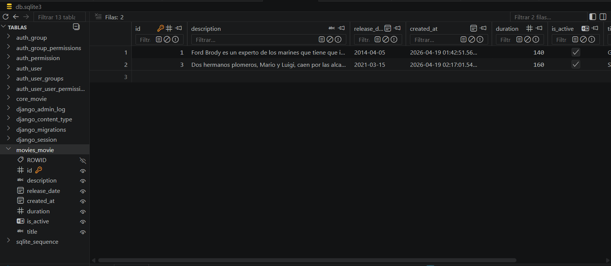

## Test-PUT http://127.0.0.1:8000/api/movies/2/
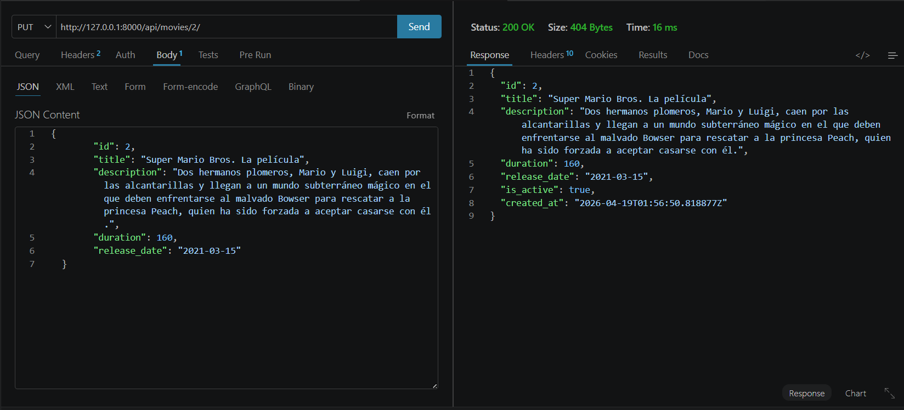
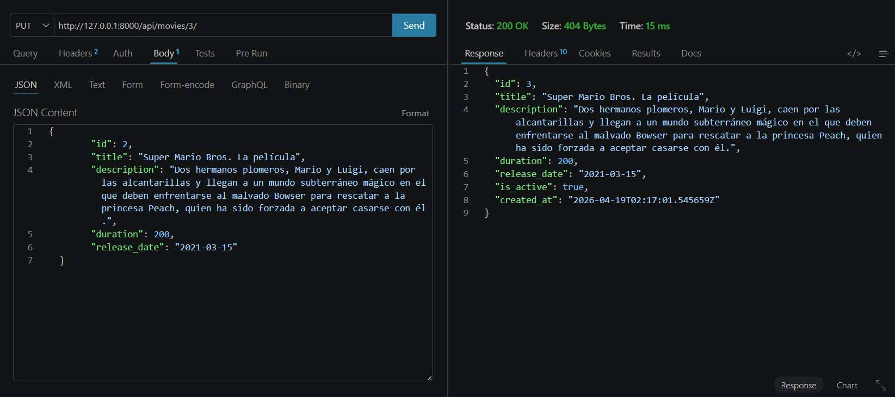

## Test-DELETE http://127.0.0.1:8000/api/movies/2/
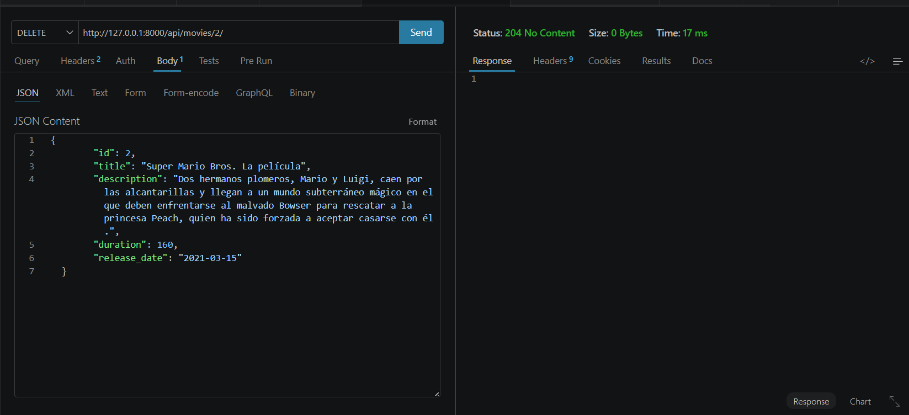

## Test-PATCH http://127.0.0.1:8000/api/movies/1/
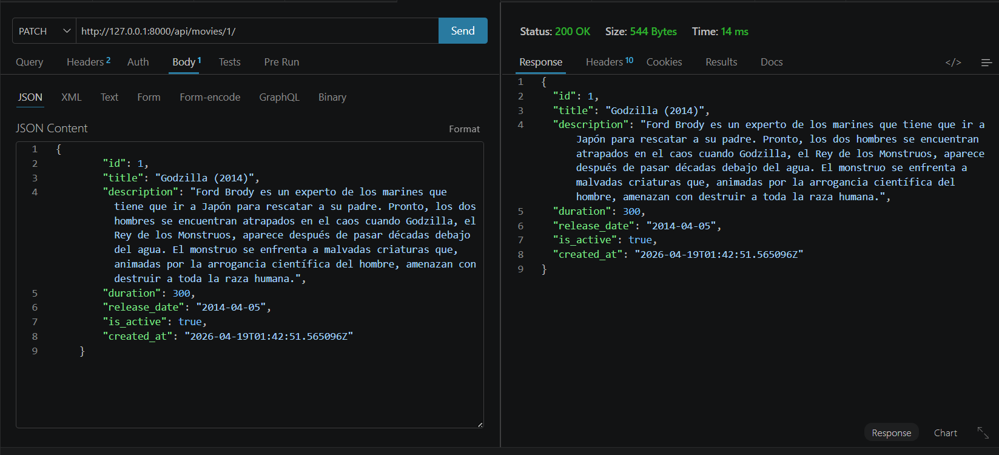
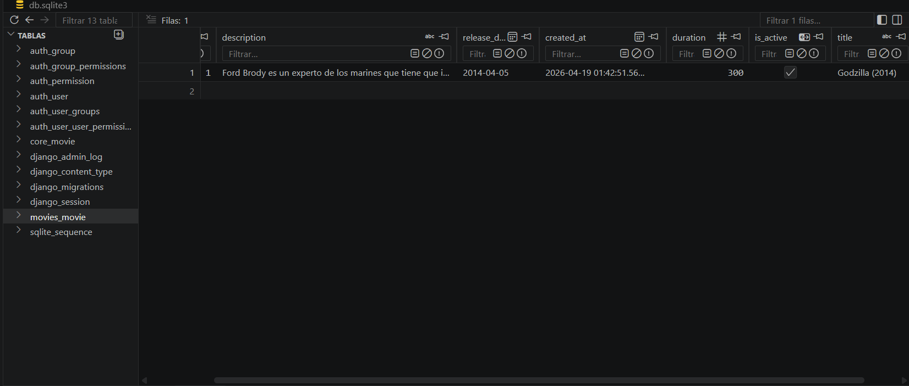

## PRUEBAS DE METODOS IMPLEMENTADOS
### POST Crear Género
`POST http://127.0.0.1:8000/api/genres/`

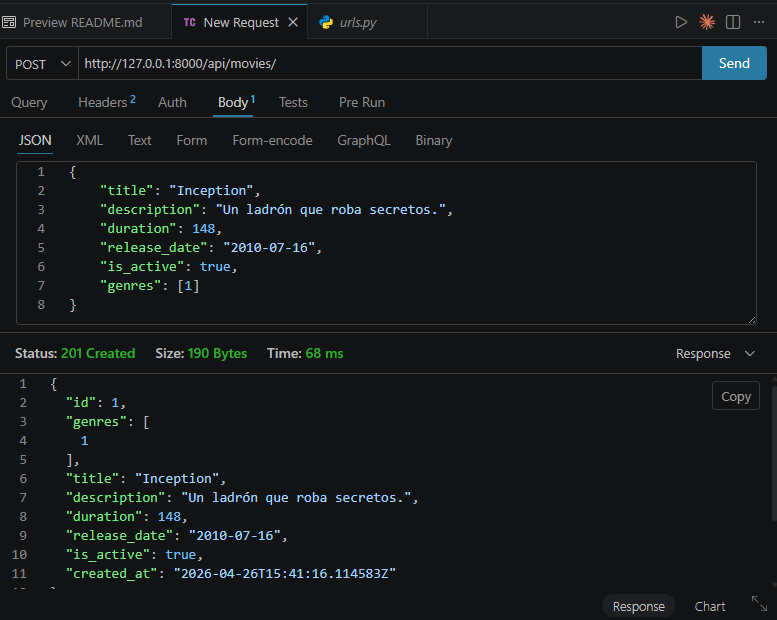
---

### POST Crear Película con Género
`POST http://127.0.0.1:8000/api/movies/`

---

## Movies
### GET Películas Activas
`GET http://127.0.0.1:8000/api/movies/active/`
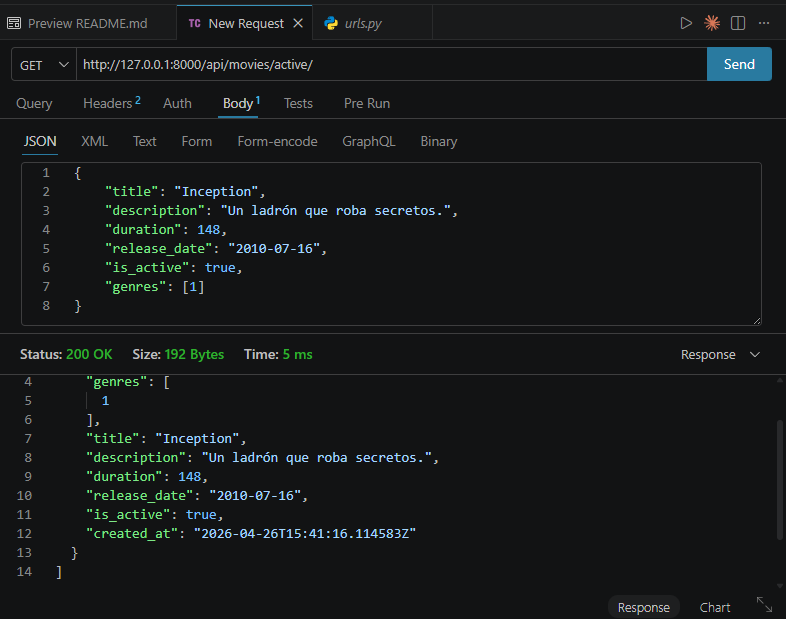

---

### GET Buscar Película por Nombre
`GET http://127.0.0.1:8000/api/movies/search/?name=inc`
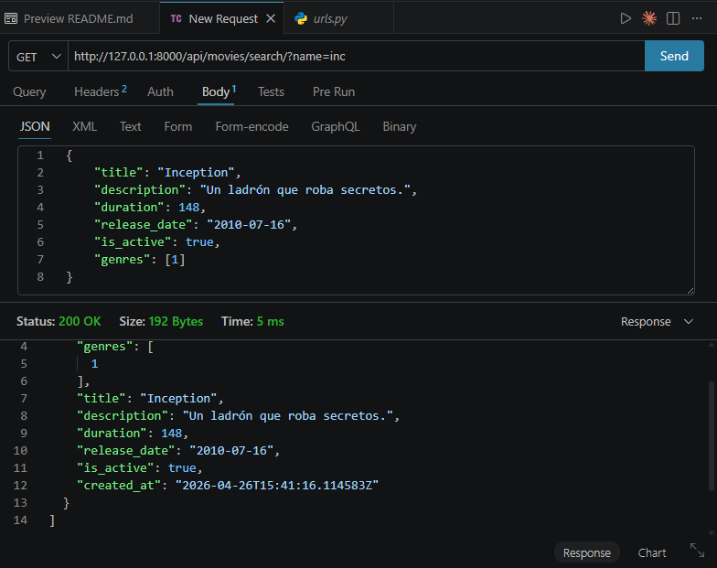

---

### GET Filtrar por Género
`GET http://127.0.0.1:8000/api/movies/by-genre/?genre_id=1`
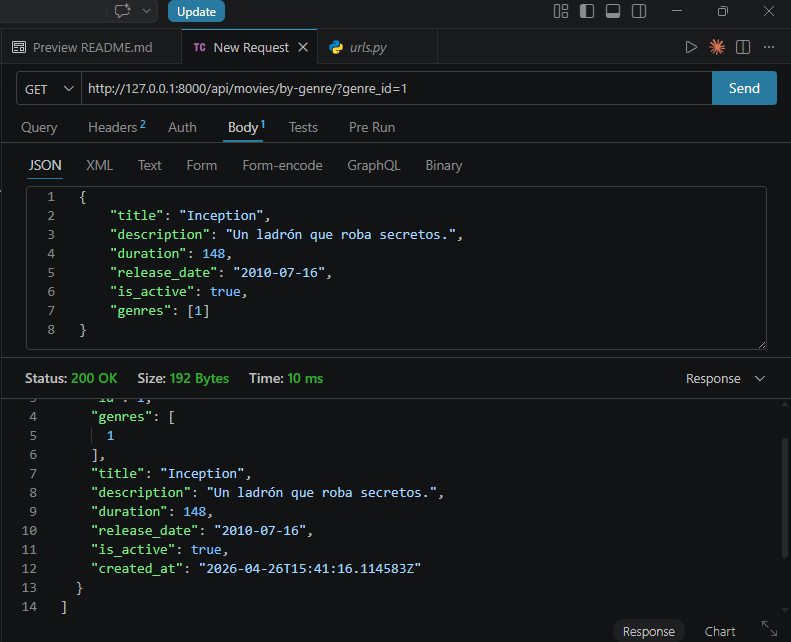

---

## Genero
### GET Buscar Género por ID
`GET http://127.0.0.1:8000/api/genres/buscar-por-id/1/`
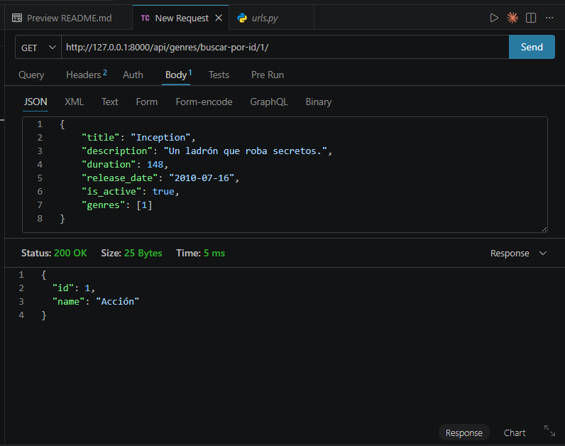

---

### GET Películas de un Género
`GET http://127.0.0.1:8000/api/genres/1/peliculas/`
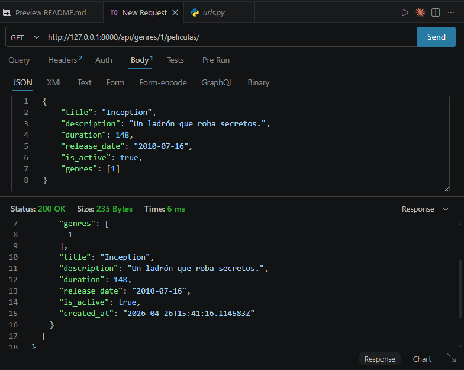

---
